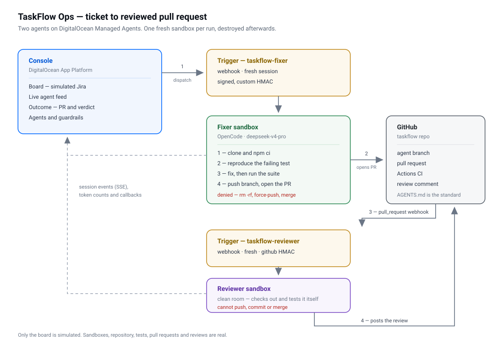

# MARS demo — ticket to reviewed pull request

A ticket is dispatched to a coding agent on **DigitalOcean Managed Agents**. The
agent fixes it on a real repository and opens a pull request. A second,
independent agent reviews that pull request and posts a verdict. Both report
back to the board, and a human still owns the merge.

| | |
|---|---|
| **Owner** | @dcabrejas |
| **Status** | Working |
| **Last validated** | 2026-09-24 |
| **Live demo** | https://mars-ticket-to-pr-console-6ms2v.ondigitalocean.app |
| **Recording** | [mars-ticket-to-pr-demo.mp4](https://demo-recordings.tor1.cdn.digitaloceanspaces.com/mars-ticket-to-pr-demo.mp4) |
| **Products shown** | Managed Agents (MARS), Gradient serverless inference, App Platform |

## Video

**[Watch the demo](https://demo-recordings.tor1.cdn.digitaloceanspaces.com/mars-ticket-to-pr-demo.mp4)**
— a full run, ticket through to reviewed pull request.

Hosted on DigitalOcean Spaces rather than committed: at 248MB it is well over
GitHub's 100MB file limit, and a binary that size does not belong in git
history.

## What it demonstrates

That an agent can take a small, well-understood backlog item and finish it
unattended, inside limits you set, with everything it did visible afterwards.

- **Unattended** — a signed webhook starts the run; nobody answers a prompt
- **On real code** — real repository, real test suite, a pull request CI checks
- **Bounded** — `rm -rf`, force-push, pushing to main and merging are denied by
  the platform, and network egress is allowlisted
- **Observable** — the feed is the session's own event stream: reasoning, every
  tool call with arguments and duration, token accounting
- **Independently reviewed** — a second agent in a separate sandbox checks the
  branch out and runs the tests itself
- **Economical** — roughly 10–20c per ticket in tokens, fixed and reviewed

> The board is a stand-in for Jira, because a demo cannot point at a production
> instance. Everything past it is real.

## Architecture



Both triggers run in `fresh` mode — one sandbox per run, destroyed afterwards —
so every run starts identically. A reused session keeps its conversation
history, which had the fixer carrying previous tickets into later runs. The
trade-off is a clone and `npm ci` per run, about twenty seconds.

## Repository layout

| Path | What it is |
|---|---|
| `agents/` | the two agent manifests: model, guardrails, egress, and each agent's skill |
| `prompts/` | the prompt templates the triggers render per run |
| `app/`, `components/`, `lib/` | the console — board, live feed, outcome, guardrails |
| `scripts/setup-mars.sh` | creates both triggers and prints what to configure |
| `scripts/reset-demo.sh` | returns the demo to a known state — run before every showing |
| `scripts/deploy.sh` | push and redeploy the console |
| `fixtures/` | a captured real run, for offline replay |
| `docs/` | architecture diagram and troubleshooting notes |

The target repository the agents work on is
[`mars-ticket-to-pr-taskflow`](https://github.com/DO-Solutions/mars-ticket-to-pr-taskflow),
which carries four seeded issues and the `AGENTS.md` conventions the reviewer
judges against.

## Setup

**Prerequisites:** `doctl` beta with `harness-runtime`, Managed Agents enabled on
the team, and a GitHub token with write access to the target repo.

```bash
# 1. credentials
mkdir -p ~/.secrets && chmod 700 ~/.secrets
printf '%s' '<DO PAT, full access>'  > ~/.secrets/do-inference.key
printf '%s' '<GitHub PAT>'           > ~/.secrets/taskflow-pat
openssl rand -hex 24                 > ~/.secrets/console-callback
chmod 600 ~/.secrets/*

# 2. deploy the console
doctl apps create --spec .do/app.yaml

# 3. create both triggers
CONSOLE_URL=https://<your-app>.ondigitalocean.app \
TARGET_REPO=<owner>/mars-ticket-to-pr-taskflow \
./scripts/setup-mars.sh
```

`setup-mars.sh` prints the environment variables to set on the app and the
webhook to add to the target repository (**Pull requests** only, content type
`application/json` — anything else and the reviewer silently reviews nothing).

Then verify:

```bash
./scripts/reset-demo.sh    # expect 5 tickets in Backlog, 4 skipped tests on main
```

The spec deploys from a public git clone URL, so there is no deploy-on-push —
use `./scripts/deploy.sh` after changes.

## Running the demo

Open the console, select **TF-101**, and press **Dispatch AI agent**. The fixer
takes 85–130s, the reviewer follows and takes 2–3 minutes.

Run `./scripts/reset-demo.sh` before every showing. It closes the agent's pull
requests, deletes its branches and clears the board.

`TF-101`, `TF-102` and `TF-104` are the rehearsed tickets. `TF-103` asks the
agent to design a feature and write its own tests, and `TF-105` deliberately
requests something the policy denies — both are worth exploring, neither is
rehearsed.

If a live run is risky — a conference, a bad network — the **replay (offline)**
button replays a captured real run through the same view, with no sandbox
involved.

## Known issues

**The review posts as a comment, not a formal approval.** Both agents share one
GitHub identity, and GitHub will not let an author formally review their own pull
request. The verdict leads the comment body and the console renders it. Giving
the reviewer its own account restores real review states.

Everything else: [`docs/TROUBLESHOOTING.md`](docs/TROUBLESHOOTING.md).

## Environment variables

| Variable | Purpose |
|---|---|
| `DO_API_TOKEN` | reads sessions, events and trigger executions |
| `GITHUB_TOKEN` | reads PR and review state; also used by reset to close PRs |
| `AGENT_CALLBACK_TOKEN` | shared secret for `/api/agent/callback` |
| `MARS_FIXER_TRIGGER_ID` / `_SECRET` | dispatch target and its signing secret |
| `MARS_REVIEWER_TRIGGER_ID` | polled to discover review runs |
| `TARGET_REPO` | the repository the agents work on |
